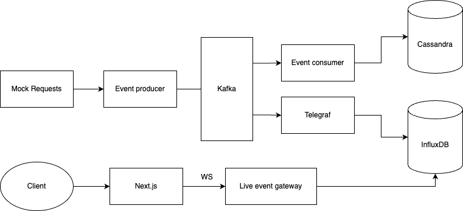

# Event Tracker
The intent with this project is to explore event driven architecture using Kafka as a message broker, InfluxDB as a time series database and Cassandra as a key value store.

## Architecture
**Current**



## Todo
- [ ] Improve the docs 😅
- [ ] Update the event generator to have more event types
- [ ] Update the event gateway so it accpets different queries
- [ ] Improve the UI


## Setup instructions
Install dependencies
```
go install github.com/db-journey/journey/v2
```

Create keyspace
```
cqlsh
create keyspace mykeyspace WITH REPLICATION = { 
   'class' : 'SimpleStrategy', 
   'replication_factor' : 1 
};
  ```
